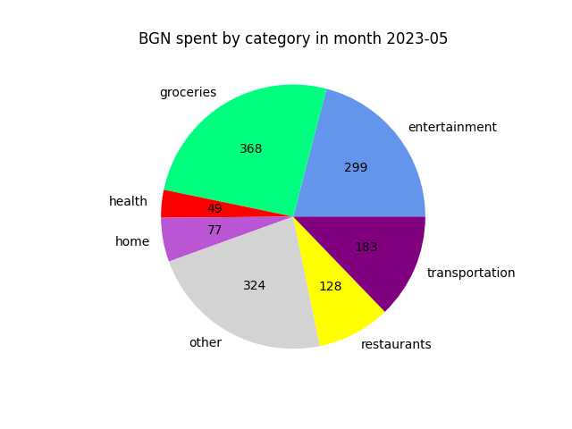
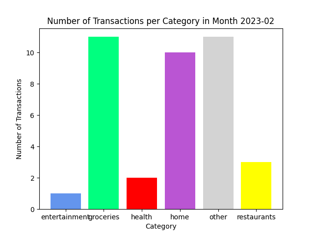

# personal-banking-visualiser
A small tool to categorise and visualise personal bank transactions.

## usage
1. Place one or more `.xls` export files from your bank into the `input/` folder.
2. Run `python app.py`.
3. A single `output/report.pdf` is generated containing all charts.

Files exported in BGN (before Bulgaria adopted the euro) are automatically converted to EUR using the fixed rate of 1.95583 BGN = 1 EUR.

## output
The report PDF contains three sections in order:
- **Multiline chart** — EUR spent per category across all months
- **Monthly pie charts** — EUR breakdown by category for each month
- **Monthly bar charts** — transaction count by category for each month

## adapt for your bank
Create a new importer for your bank's exported file and make sure it outputs a CSV to the `output` folder with the following columns:
 - `date` - in pandas format yyyy-mm-dd (ex. 2022-12-28)
 - `amount_eur` - number (ex. 5.99)
 - `description` - text

## examples

