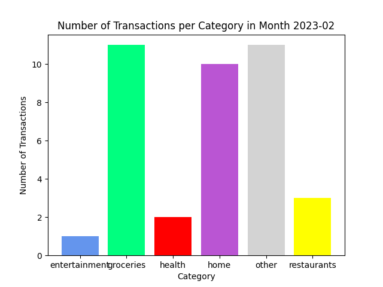

# personal-banking-visualiser
A small tool to categorise and visualise personal bank transactions.

## adapt for your bank
create a new importer for your bank's exported file of transactions and make sure it outputs it in a csv
file named `ready_to_import.csv` in the `output` folder with the following columns and data types:
 - `date` - in pandas format yyyy-mm-dd (ex. 2022-12-28)
 - `amount_bgn` - number (ex. 5.99)
 - `description` - text

## examples

